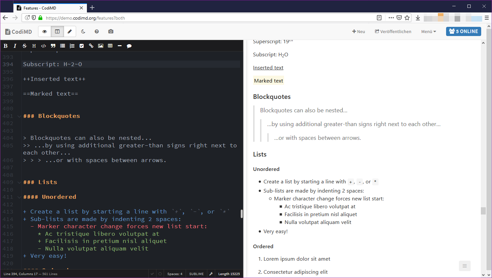

CodiMD
===

[![#CodiMD on matrix.org][matrix.org-image]][matrix.org-url]
[![build status][travis-image]][travis-url]
[![version][github-version-badge]][github-release-page]
[![POEditor][poeditor-image]][poeditor-url]
[![Mastodon][social-mastodon-image]][social-mastodon]

CodiMD lets you create real-time collaborative markdown notes. You can test-drive
it by visiting our [CodiMD demo server][codimd-demo].

It is inspired by Hackpad, Etherpad and similar collaborative editors. This
project originated with the team at [HackMD](https://hackmd.io) and now forked
into its own organisation. [A longer writeup can be read in the history doc](docs/history.md).

[][codimd-demo-features]

## Community and Contributions

We welcome contributions! There's a lot to do: If you would like to report bugs,
the [issue tracker][github-issue-tracker] is the right place. If you can help
translating, find us on [POEditor][poeditor-url]. To get started developing,
take a look at the [docs/dev](docs/dev) directory. In any case: come talk to us,
we'll be delighted to help you with the first steps.

To stay up to date with our work or get support it's recommended to join our
[Matrix channel][matrix.org-url], stop by our [community forums][codimd-community]
or subscribe to the [release feed][github-release-feed]. We also engage in
regular [community calls][codimd-community-calls] ([RSS](https://community.codimd.org/t/codimd-community-call/19.rss)) which you are very welcome to join.

## Installation / Upgrading

You can run CodiMD in a number of ways, and we created setup instructions for
all of these:

* [Docker](docs/setup/docker.md)
* [Kubernetes](docs/setup/kubernetes.md)
* [Cloudron](docs/setup/cloudron.md)
* [Heroku](docs/setup/heroku.md)
* [manual setup](docs/setup/manual-setup.md)

If you do not wish to run your own setup, you can find a commercial offering at
https://hackmd.io. This is not the same codebase as this one, but it is a very
similar project.

## Configuration

Theres two main ways to configure your CodiMD instance:
[Config file](docs/configuration-config-file.md) or
[environment variables](docs/configuration-env-vars.md). You can choose what
works best for you.

CodiMD can integrate with

* facebook, twitter, github, gitlab, mattermost, dropbox, google, ldap, saml and [oauth2](docs/guides/auth/oauth.md) **for login**
* imgur, s3, minio, azure **for image/attachment storage** (files can also be local!)
* dropbox **for export and import**

More info about that can be found in the configuration docs above.

## Browser support

To use CodiMD, your browser should match or exceed these versions:

-  Chrome >= 47, Chrome for Android >= 47
-  Safari >= 9, iOS Safari >= 8.4
-  Firefox >= 44
-  IE >= 9, Edge >= 12
-  Opera >= 34, Opera Mini not supported
- Android Browser >= 4.4

## Related Tools

Our community has created related tools, we'd like to highlight [codimd-cli](https://github.com/codimd/cli)
which lets you use CodiMD from the comfort of your command line.

# License

Licensed under AGPLv3. For our list of contributors, see [AUTHORS](AUTHORS).

[matrix.org-image]: https://img.shields.io/badge/Matrix.org-%23CodiMD@matrix.org-green.svg
[matrix.org-url]: https://riot.im/app/#/room/#codimd:matrix.org
[travis-image]: https://travis-ci.org/codimd/server.svg?branch=master
[travis-url]: https://travis-ci.org/codimd/server
[github-version-badge]: https://img.shields.io/github/release/codimd/server.svg
[github-release-page]: https://github.com/codimd/server/releases
[github-release-feed]: https://github.com/codimd/server/releases.atom
[github-issue-tracker]: https://github.com/codimd/server/issues/
[poeditor-image]: https://img.shields.io/badge/POEditor-translate-blue.svg
[poeditor-url]: https://poeditor.com/join/project/1OpGjF2Jir
[codimd-demo]: https://demo.codimd.org
[codimd-demo-features]: https://demo.codimd.org/features
[codimd-community]: https://community.codimd.org
[codimd-community-calls]: https://community.codimd.org/t/codimd-community-call/19
[social-mastodon]: https://social.codimd.org/mastodon
[social-mastodon-image]: https://img.shields.io/badge/social-mastodon-3c99dc.svg
