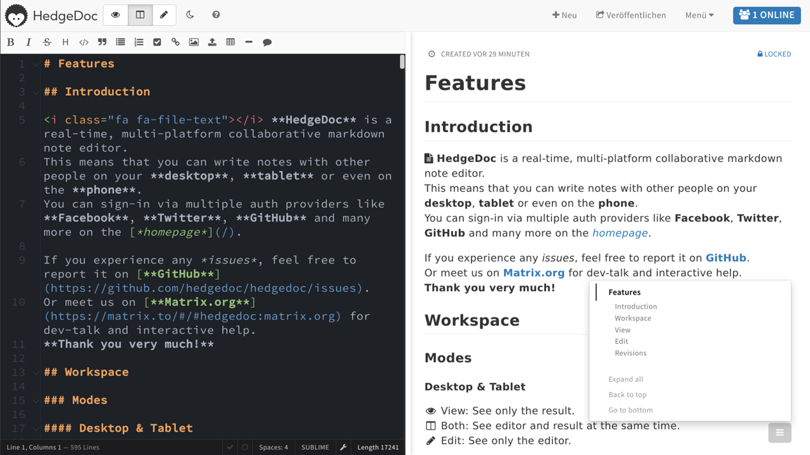

# HedgeDoc

[![#HedgeDoc on matrix.org][matrix.org-image]][matrix.org-url]
[![version][github-version-badge]][github-release-page]
[![POEditor][poeditor-image]][poeditor-url]
[![Mastodon][social-mastodon-image]][social-mastodon]

HedgeDoc lets you create real-time collaborative markdown notes. You can test-drive
it by visiting our [HedgeDoc demo server][hedgedoc-demo].

It is inspired by Hackpad, Etherpad and similar collaborative editors. This
project originated with the team at [HackMD](https://hackmd.io) and now forked
into its own organisation. [A longer writeup can be read in the history][history].

[][hedgedoc-demo-features]

## Community and Contributions

We welcome contributions! There's a lot to do: If you would like to report bugs,
the [issue tracker][github-issue-tracker] is the right place. If you can help
translating, find us on [POEditor][poeditor-url]. To get started developing,
take a look at the [developer documentation][developer-documentation]. In any case: come talk to us,
we'll be delighted to help you with the first steps.

To stay up to date with our work or get support it's recommended to join our
[Matrix channel][matrix.org-url], stop by our [community forums][hedgedoc-community]
or subscribe to the [release feed][github-release-feed]. We also engage in
regular [community calls][hedgedoc-community-calls] ([RSS](https://community.hedgedoc.org/t/codimd-community-call/19.rss)) which you are very welcome to join.

## Installation / Upgrading

You can run HedgeDoc in a number of ways, and we created setup instructions for
all of these:

- [Docker][setup-docker]
- [Cloudron][setup-cloudron]
- [LinuxServer.io (multi-arch docker)][setup-docker-linuxserver]
- [Heroku][setup-heroku]
- [Manual setup][setup-manual]

## Configuration

Theres two main ways to [configure][configuration] your HedgeDoc instance:
config file or environment variables. You can choose what works best for you.

HedgeDoc can integrate with

- facebook, twitter, github, gitlab, mattermost, dropbox, google, ldap, saml and [oauth2][configuration-oauth] **for login**
- imgur, s3, minio, azure **for image/attachment storage** (files can also be local!)
- dropbox **for export and import**

More info about that can be found in the configuration docs above.

## Browser support

To use HedgeDoc, your browser should match or exceed these versions:

-  Chrome >= 47,  Chrome for Android >= 47
-  Safari >= 10.1,  iOS Safari >= 10.3
-  Firefox >= 44
-  Edge >= 14
-  Opera >=
  34, 
  Opera Mini not supported
-  Android Browser >= 4.4

## Backup/restore your instance

To backup HedgeDoc, you should:

- backup your database
- backup your custom config file if you have one
- backup the upload folder (see the [uploadsPath][configuration-paths] config directive) 

Restoring an existing instance of HedgeDoc is then just a matter of restoring these elements.

## Related Tools

Our community has created related tools, we'd like to highlight [hedgedoc-cli](https://github.com/hedgedoc/cli)
which lets you use HedgeDoc from the comfort of your command line.

## License

Licensed under AGPLv3. For our list of contributors, see [AUTHORS](AUTHORS).

The license does not include the HedgeDoc logo, whose terms of usage can be found in the [github repository](https://github.com/hedgedoc/hedgedoc-logo).

[configuration-oauth]: https://docs.hedgedoc.org/configuration/#oauth2-login
[configuration]: https://docs.hedgedoc.org/configuration/
[configuration-paths]: https://docs.hedgedoc.org/configuration/#hedgedoc-paths-stuff
[setup-docker]: https://docs.hedgedoc.org/setup/docker/
[setup-cloudron]: https://docs.hedgedoc.org/setup/cloudron/
[setup-docker-linuxserver]: https://docs.hedgedoc.org/setup/docker-linuxserver/
[setup-heroku]: https://docs.hedgedoc.org/setup/heroku/
[setup-manual]: https://docs.hedgedoc.org/setup/manual-setup/
[developer-documentation]: https://docs.hedgedoc.org/dev/getting-started/
[history]: https://docs.hedgedoc.org/history/
[matrix.org-image]: https://img.shields.io/matrix/hedgedoc:matrix.org?logo=matrix&server_fqdn=matrix.org
[matrix.org-url]: https://chat.hedgedoc.org
[github-version-badge]: https://img.shields.io/github/release/hedgedoc/hedgedoc.svg
[github-release-page]: https://github.com/hedgedoc/hedgedoc/releases
[github-release-feed]: https://github.com/hedgedoc/hedgedoc/releases.atom
[github-issue-tracker]: https://github.com/hedgedoc/hedgedoc/issues/
[poeditor-image]: https://img.shields.io/badge/POEditor-translate-blue.svg
[poeditor-url]: https://poeditor.com/join/project/1OpGjF2Jir
[hedgedoc-demo]: https://demo.hedgedoc.org
[hedgedoc-demo-features]: https://demo.hedgedoc.org/features
[hedgedoc-community]: https://community.hedgedoc.org
[hedgedoc-community-calls]: https://community.hedgedoc.org/t/codimd-community-call/19
[social-mastodon]: https://social.hedgedoc.org/mastodon
[social-mastodon-image]: https://img.shields.io/mastodon/follow/109259563190314667?domain=https%3A%2F%2Ffosstodon.org&style=social
