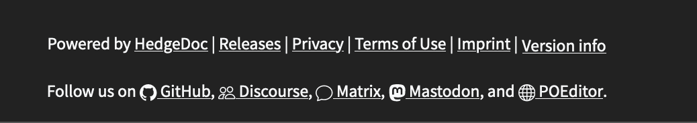
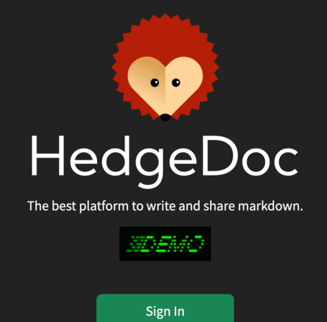
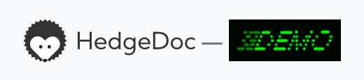
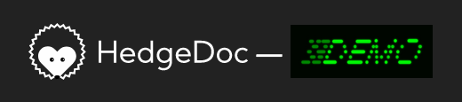
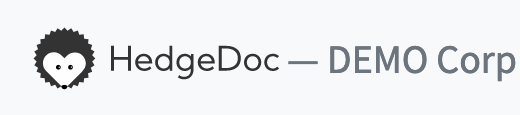
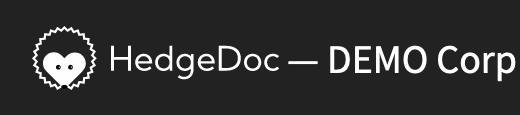

HedgeDoc can be configured via environment variables either directly or via an `.env` file.

## The `.env` file

The `.env` file should be placed in the root of the project and contains key-value pairs of
environment variables and their corresponding value. This can for example look like this:

```ini
HD_BASE_URL="http://localhost:8080"
HD_SESSION_SECRET="change_me_in_production"
HD_DATABASE_TYPE="sqlite"
HD_DATABASE_NAME="./hedgedoc.sqlite"
HD_MEDIA_BACKEND="filesystem"
HD_MEDIA_BACKEND_FILESYSTEM_UPLOAD_PATH="uploads/"
```

We also provide an `.env.example` file containing a minimal configuration in the root of the project.
This should help you to write your own configuration.

!!! warning  
    The minimal configuration provided in `.env.example` is exactly that: minimal.  
    It will let you start HedgeDoc for local development,
    but it is **not** meant to be used in production without prior changes.

## General

| environment variable     | default                | example                     | description                                                                                                                                            |
|--------------------------|------------------------|-----------------------------|--------------------------------------------------------------------------------------------------------------------------------------------------------|
| `HD_BASE_URL`            | -                      | `https://md.example.com`    | The URL the HedgeDoc instance is accessed with, like it is entered in the browser                                                                      |
| `HD_BACKEND_PORT`        | 3000                   |                             | The port the backend process listens on.                                                                                                               |
| `HD_FRONTEND_PORT`       | 3001                   |                             | The port the frontend process listens on.                                                                                                              |
| `HD_RENDERER_BASE_URL`   | Content of HD_BASE_URL |                             | The URL the renderer runs on. If omitted this will be the same as `HD_BASE_URL`.                                                                       |
| `HD_LOGLEVEL`            | warn                   |                             | The loglevel that should be used. Options are `error`, `warn`, `info`, `debug` or `trace`.                                                             |
| `HD_FORBIDDEN_NOTE_IDS`  | -                      | `notAllowed,alsoNotAllowed` | A list of note ids (separated by `,`), that are not allowed to be created or requested by anyone.                                                      |
| `HD_MAX_DOCUMENT_LENGTH` | 100000                 |                             | The maximum length of any one document. Changes to this will impact performance for your users.                                                        |
| `HD_PERSIST_INTERVAL`    | 10                     | `0`, `5`, `10`, `20`        | The time interval in **minutes** for the periodic note revision creation during realtime editing. `0` deactivates the periodic note revision creation. |

### Why should I want to run my renderer on a different (sub-)domain?

If the renderer is provided by another domain, it's way harder to manipulate HedgeDoc or
steal credentials from the rendered note content, because renderer and editor are more isolated.
This increases the security of the software and greatly mitigates [XSS attacks](https://en.wikipedia.org/wiki/Cross-site_scripting).
However, you can run HedgeDoc without this extra security, but we recommend using it if possible.

!!! note
    When you want to use a separate domain for `HD_RENDERER_BASE_URL`, your reverse proxy config needs
    to be adjusted to direct requests for this domain to the frontend.

## Notes

| environment variable                     | default | example                           | description                                                                                                                                                                          |
|------------------------------------------|---------|-----------------------------------|--------------------------------------------------------------------------------------------------------------------------------------------------------------------------------------|
| `HD_FORBIDDEN_NOTE_IDS`                  | -       | `notAllowed, alsoNotAllowed`      | A list of note ids (separated by `,`), that are not allowed to be created or requested by anyone.                                                                                    |
| `HD_MAX_DOCUMENT_LENGTH`                 | 100000  |                                   | The maximum length of any one document. Changes to this will impact performance for your users.                                                                                      |
| `HD_GUEST_ACCESS`                        | `write` | `deny`, `read`, `write`, `create` | Defines the maximum access level for guest users to the instance. If guest access is set lower than the "everyone" permission of a note then the note permission will be overridden. |
| `HD_PERMISSION_LOGGED_IN_DEFAULT_ACCESS` | `write` | `none`, `read`, `write`           | The default permission for the "logged-in" group that is set on new notes.                                                                                                           |
| `HD_PERMISSION_EVERYONE_DEFAULT_ACCESS`  | `read`  | `none`, `read`, `write`           | The default permission for the "everyone" group (logged-in & guest users), that is set on new notes created by logged-in users. Notes created by guests always set this to "write".  |

## Authentication

!!! info
    HedgeDoc 2 does not yet support all authentication backends from HedgeDoc 1.
    You can follow [this issue](https://github.com/hedgedoc/hedgedoc/issues/1006) for details.

### Local

HedgeDoc provides local accounts, handled internally. This feature only provides basic functionality,
so for most environments we recommend using an external authentication mechanism, which also enable
more secure authentication like 2FA or WebAuthn.

| environment variable                      | default | example                 | description                                                                           |
|-------------------------------------------|---------|-------------------------|---------------------------------------------------------------------------------------|
| `HD_AUTH_LOCAL_ENABLE_LOGIN`              | `false` | `true`, `false`         | This makes it possible to use the local accounts in HedgeDoc.                         |
| `HD_AUTH_LOCAL_ENABLE_REGISTER`           | `false` | `true`, `false`         | This makes it possible to register new local accounts in HedgeDoc.                    |
| `HD_AUTH_LOCAL_MINIMAL_PASSWORD_STRENGTH` | `2`     | `0`, `1`, `2`, `3`, `4` | The minimum [zxcvbn-ts][zxcvbn-ts-score] password score, that passwords need to have. |

#### Password score ([zxcvbn-ts][zxcvbn-ts-score])

| score | meaning                                                           | minimum number of guesses required (approximated) |
|:-----:|-------------------------------------------------------------------|---------------------------------------------------|
|   0   | All passwords are allowed                                         | -                                                 |
|   1   | Only `too guessable` passwords are disallowed                     | 1.000                                             |
|   2   | `too guessable` and `very guessable` passwords are disallowed     | 1.000.000                                         |
|   3   | `safely unguessable` and `very unguessable` passwords are allowed | 100.000.000                                       |
|   4   | Only `very unguessable` passwords are allowed                     | 10.000.000.000                                    |

### LDAP

HedgeDoc can use an LDAP server to authenticate users. As HedgeDoc supports multiple LDAP servers, you first need to tell HedgeDoc the servers you want to configure (`HD_AUTH_LDAPS`), and then you need to provide a few variables for those LDAP servers depending on how you want to use them.
Each of those variables will contain the given name for this LDAP server. For example if you named your ldap server `MY_LDAP` all variables for this server will start with `HD_AUTH_LDAP_MY_LDAP`.

| environment variable                       | default              | example                                            | description                                                                                             |
|--------------------------------------------|----------------------|----------------------------------------------------|---------------------------------------------------------------------------------------------------------|
| `HD_AUTH_LDAPS`                            | -                    | `MY_LDAP`                                          | A list of LDAP servers HedgeDoc should use, comma-seperated.                                            |
| `HD_AUTH_LDAP_$NAME_PROVIDER_NAME`         | `LDAP`               | `My LDAP`                                          | The name for the ldap server `$NAME`, that is shown in the UI of HegdeDoc.                              |
| `HD_AUTH_LDAP_$NAME_URL`                   | -                    | `https://ldap.example.com`                         | The url with which the LDAP server `$NAME` can be accessed.                                             |
| `HD_AUTH_LDAP_$NAME_SEARCH_BASE`           | -                    | `ou=users,dc=ldap,dc=example,dc=com`               | Where the user accounts are saved on the ldap server `$NAME`.                                           |
| `HD_AUTH_LDAP_$NAME_SEARCH_FILTER`         | `(uid={{username}})` | `(&(uid={{username}})(objectClass=inetOrgPerson))` | Which user accounts should be accessible from the ldap server `$NAME`.                                  |
| `HD_AUTH_LDAP_$NAME_SEARCH_ATTRIBUTES`     | -                    | `username,cn`                                      | A comma-seperated list of attributes that the search filter from the ldap server `$NAME` should access. |
| `HD_AUTH_LDAP_$NAME_USERID_FIELD`          | `uid`                | `uid`, `uidNumber`, `sAMAccountName`               | Which field of the user account should be used as an id for the ldap server `$NAME`.                    |
| `HD_AUTH_LDAP_$NAME_DISPLAY_NAME_FIELD`    | `displayName`        | `displayName`, `name`, `cn`                        | Which field of the user account should be used as the display name for the ldap server `$NAME`.         |
| `HD_AUTH_LDAP_$NAME_PROFILE_PICTURE_FIELD` | `jpegPhoto`          | `jpegPhoto`, `thumbnailPhoto`                      | Which field of the user account should be used as the user image for the ldap server `$NAME`.           |
| `HD_AUTH_LDAP_$NAME_BIND_DN`               | -                    | `cn=admin,dc=ldap,dc=example,dc=com`               | With which dn the ldap server `$NAME` should be accessed.                                               |
| `HD_AUTH_LDAP_$NAME_BIND_CREDENTIALS`      | -                    | `MyLdapPassword`                                   | The corresponding credential to access the ldap server `$NAME`.                                         |
| `HD_AUTH_LDAP_$NAME_TLS_CERT_PATHS`        | -                    | `ldap-ca.pem`                                      | A comma-seperated list of TLS certificates for the ldap server `$NAME`.                                 |

**ToDo:** Add other authentication methods.

## Customization

HedgeDoc allows you to set a name or logo for your organization. How this looks and where this is used, can be seen below. You can also provide a privacy policy, terms of use or an imprint url for your HedgeDoc instance.

| environment variable  | default | example                           | description                                                                                                                                                                |
|-----------------------|---------|-----------------------------------|----------------------------------------------------------------------------------------------------------------------------------------------------------------------------|
| `HD_CUSTOM_NAME`      | -       | `DEMO Corp`                       | The text will be shown in the top right corner in the editor and on the intro page. If you also configure a custom logo, this will be used as the alt text of the logo.    |
| `HD_CUSTOM_LOGO`      | -       | `https://md.example.com/logo.png` | The logo will be shown in the top right corner in the editor and on the intro page.                                                                                        |
| `HD_PRIVACY_URL`      | -       | `https://md.example.com/privacy`  | The URL that should be linked as the privacy notice in the footer.                                                                                                         |
| `HD_TERMS_OF_USE_URL` | -       | `https://md.example.com/terms`    | The URL that should be linked as the terms of user in the footer.                                                                                                          |
| `HD_IMPRINT_URL`      | -       | `https://md.example.com/imprint`  | The URL that should be linked as the imprint in the footer.                                                                                                                |

### Example

#### Links

  
*links for the privacy policy, terms of use and imprint on the front page*

#### Logo

For this demo we use this image:  


  
*logo used on the front page*

  
*logo used in the editor*

#### Name

For this demo we use the name `DEMO Corp`

    
*name used on the front page*

  
*name used in the editor*

## Database

We officially support and test these databases:

- SQLite (for development and smaller instances)
- PostgreSQL
- MariaDB

| environment variable  | default | example             | description                                                                                |
|-----------------------|---------|---------------------|--------------------------------------------------------------------------------------------|
| `HD_DATABASE_TYPE`    | -       | `postgres`          | The database type you want to use. This can be `postgres`, `mysql`, `mariadb` or `sqlite`. |
| `HD_DATABASE_NAME`    | -       | `hedgedoc`          | The name of the database to use. When using SQLite, this is the path to the database file. |
| `HD_DATABASE_HOST`    | -       | `db.example.com`    | The host, where the database runs. *Only if you're **not** using `sqlite`.*                |
| `HD_DATABASE_PORT`    | -       | `5432`              | The port, where the database runs. *Only if you're **not** using `sqlite`.*                |
| `HD_DATABASE_USER`    | -       | `hedgedoc`          | The user that logs in the database. *Only if you're **not** using `sqlite`.*               |
| `HD_DATABASE_PASS`    | -       | `password`          | The password to log into the database. *Only if you're **not** using `sqlite`.*            |

## External services

| environment variable   | default | example                             | description                                                                                                                          |
|------------------------|---------|-------------------------------------|--------------------------------------------------------------------------------------------------------------------------------------|
| `HD_PLANTUML_SERVER`   | -       | `https://www.plantuml.com/plantuml` | The PlantUML server that HedgeDoc uses to render PlantUML diagrams. If this is not configured, PlantUML diagrams won't be rendered.  |
| `HD_IMAGE_PROXY`       | -       | `https://image-proxy.example.com`   | **ToDo:** Add description                                                                                                            |

## Media

There are a couple of different backends that can be used to host your images for HedgeDoc.

- [Azure](media/azure.md)
- [Local filesystem](media/filesystem.md)
- [Imgur](media/imgur.md)
- [S3-compatible](media/s3.md)
- [WebDAV](media/webdav.md)


[zxcvbn-ts-score]: https://zxcvbn-ts.github.io/zxcvbn/guide/getting-started/#output
