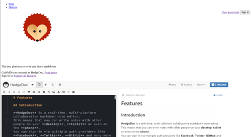
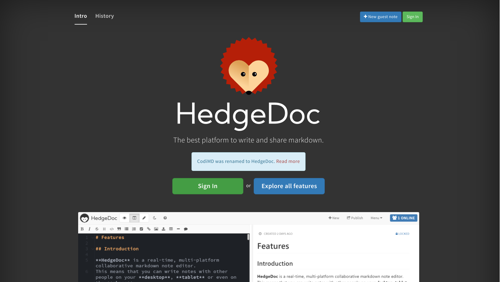

# FAQ

This page collects Frequently Asked Questions of the community.  
If you have any questions that aren't answered here, feel free to ask us on [Matrix][matrix.org-url] or stop by our [community forums][hedgedoc-community].

[matrix.org-url]: https://chat.hedgedoc.org
[hedgedoc-community]: https://community.hedgedoc.org

## Why is CodiMD now called HedgeDoc?
The short version: There were two CodiMD-projects on GitHub, the community-driven fork and the original project maintained by the HackMD-team.
To solve this naming conflict, our community-driven version was renamed to HedgeDoc.
For a full writeup, check out the [history overview](https://hedgedoc.org/history/).

## Can I run multiple instances on the same database?
No. The HedgeDoc server process is not entirely stateless and therefore running more than one instance will result in missing/broken content for users.
In order to solve issues like HA-capabilities, please use a high level orchestrator that makes sure that always 1 instance is running on your infrastructure and that the database is available.
The server process usually starts within seconds and therefore the possible downtime should be minimal.

## Why was the PDF Export feature removed?
We used a headless Chromium instance to generate the PDFs, but that led to some security vulnerabilities and was therefore deactivated.
There are currently plans to re-add this feature in a safe way, but this will most likely take some time and can be expected at the earliest with HedgeDoc 2.1 (but could also take longer).  
In the meantime you can use your browsers print to PDF Feature.
This [page](https://www.digitaltrends.com/computing/how-to-save-a-webpage-as-a-pdf/) explains how to do that for multiple browsers.

## Why can't I embed some PDFs?  
Many servers don't allow the embedding of their content on arbitrary sites.

For a more technical explanation:  
The `X-Frame-Options` header can be used to specify if a given webpage can be embedded.
For security reasons this header is often set to `SAMEORIGIN`, which disallows embedding on other origins.
To be able to embed a PDF inside a HedgeDoc note, the server that hosts the PDF must either send no `X-Frame-Options`
header (which might be insecure) or include the URI of your HedgeDoc instance in an `ALLOW-FROM` statement.
See [Mozillas docs](https://developer.mozilla.org/en-US/docs/Web/HTTP/Headers/X-Frame-Options) for more details.  
Also note that the `X-Frame-Options` header [is being obsoleted](https://developer.mozilla.org/en-US/docs/Web/HTTP/Headers/Content-Security-Policy/frame-ancestors)
by the `frame-ancestors` statement in the `Content-Security-Policy` header.

## Why can't I embed a HedgeDoc note in other pages using iframes?
Allowing your HedgeDoc instance to be embedded in other pages increases the risk of [clickjacking](https://en.wikipedia.org/wiki/Clickjacking),
[XSS](https://en.wikipedia.org/wiki/Cross-site_scripting) and other attacks.
Therefore, **we recommend to not enable** this option.  
If you still want to allow embedding via iframe, ensure that:

- Your HedgeDoc instance is served via HTTPS
- `cookiePolicy` / `CMD_COOKIE_POLICY` is set to `none` (Otherwise you will get a `AUTH failed: No cookie transmitted` error.)
- `csp.allowFraming` / `CMD_CSP_ALLOW_FRAMING` is set to `true`

See also the [configuration docs](/configuration/#web-security-aspects) for more information about these options.

## I can't upload images or the upload gets stuck
This problem is typically accompanied by the error `Invalid URL: /uploads/` in the log and is often caused by a missing
`domain` / `CMD_DOMAIN` config option or an incorrect reverse proxy config.  
Have a look at our [reverse proxy documentation](https://docs.hedgedoc.org/guides/reverse-proxy/)
and make sure that `protocolUseSSL` / `CMD_PROTOCOL_USESSL` is set to `true` if you serve HedgeDoc via HTTPS.

## HedgeDoc fails executing migrations and does not start
Unfortunately, older versions of HedgeDoc had some bugs regarding migrations and didn't always record that a migration was executed.  
Have a look at the *[Troubleshooting Migrations](/guides/migration-troubleshooting/)* guide for more information.

## Why does my interface look weird?

If your interface looks like this

instead of this

then HedgeDoc can't find the asset files like images, stylesheets, fonts, etc.
You should check the following settings (or their corresponding environment variables if you e.g. use docker.):

- `domain` (env: `CMD_DOMAIN`)
- `protocolUseSSL` (env: `CMD_PROTOCOL_USESSL`)
- `urlAddPort` (env: `CMD_URL_ADDPORT`)

Check [the reverse proxy guide](../guides/reverse-proxy/#configure-asset-link-generation) for an explanation.
