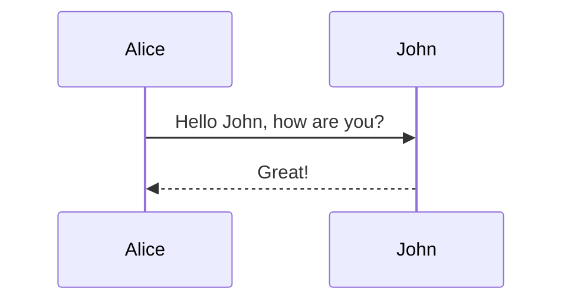

# Frequently Asked Questions

This page collects Frequently Asked Questions of the community.  
If you have any questions that aren't answered here, feel free to ask on our
[community forums][hedgedoc-community] or in out [Matrix chat][matrix.org-url].

[matrix.org-url]: https://chat.hedgedoc.org
[hedgedoc-community]: https://community.hedgedoc.org

## Why did you switch from MathJax to KaTeX?

The new react frontend, that was introduced with HedgeDoc 2.0 switched from MathJax 2
to [KaTeX][katex], because:

- [KaTeX is much faster than MathJax](https://www.intmath.com/cg5/katex-mathjax-comparison.php?processor=MathJax )
- [The MathJax React Component is not maintained and doesn't support MathJax 3](https://github.com/wko27/react-mathjax)
- [KaTeX supports every command you'll need for math expressions](https://katex.org/docs/supported.html)

[katex]: https://katex.org/

## Why are code-blocks with 'sequence' as language deprecated?

Starting with HedgeDoc 2.0, mermaid is used for rendering sequence-diagrams.
The [syntax][mermaid-syntax] doesn't change. To remove the deprecation warning, simply change the
codeblock-"language" from `sequence` to `mermaid` and insert a single line with `sequenceDiagram`
just before your diagram content.

**Deprecated**:

```sequence
Alice->>John: Hello John, how are you?
John-->>Alice: Great!
```

**New**:



[mermaid-syntax]: https://mermaid-js.github.io/mermaid/#/sequenceDiagram

## Why do tags in headings don't work anymore?

Starting with HedgeDoc 2.0, we don't support tag headings in the note anymore.

```markdown
#### tags: `tag1`, `tag2`
```

Instead, please use the [frontmatter metadata][frontmatter] to specify tags.

[frontmatter]: https://demo.hedgedoc.org/yaml-metadata#tags

## Why is the comma separated definition of tags in the YAML-metadata deprecated?

[YAML already has a definition for lists](https://yaml.org/spec/1.2/spec.html#id2759963).
Therefore, we don't see any reason to maintain another way to define a list.

<!-- markdownlint-disable no-emphasis-as-heading -->
**Deprecated**
<!-- markdownlint-enable no-emphasis-as-heading -->

```yaml
tags: tag1, tag2
```

<!-- markdownlint-disable no-emphasis-as-heading -->
**New**
<!-- markdownlint-enable no-emphasis-as-heading -->

```yaml
tags:
    - tag1
    - tag2
```

<!-- markdownlint-disable no-emphasis-as-heading -->
*or*
<!-- markdownlint-enable no-emphasis-as-heading -->

```yaml
tags: ['tag1', 'tag2']
```

## Why should I want to run my renderer on a different (sub-)domain?

If the renderer is provided by another domain, it's way harder to manipulate HedgeDoc or
steal credentials from the rendered note content, because renderer and editor are more isolated.
This increases the security of the software and greatly mitigates [XSS attacks][xss].
However, you can run HedgeDoc without this extra security, but we recommend using it if possible.

!!! note
    When you want to use a separate domain for `HD_RENDERER_BASE_URL`, your reverse proxy config
    needs to be adjusted to direct requests for this domain to the frontend.

[xss]: https://en.wikipedia.org/wiki/Cross-site_scripting

## Why are forkawesome icons deprecated?

As forkawesome icons are not really well maintained, we decided to replace them with
[bootstrap icons][bootstrap-icons]. To keep the compatibility with HedgeDoc 1 notes
we still import them, but will likely remove those icons at some point. So your
best take of action is replacing these icons with [bootstrap icons][bootstrap-icons].

[bootstrap-icons]: https://icons.getbootstrap.com/
