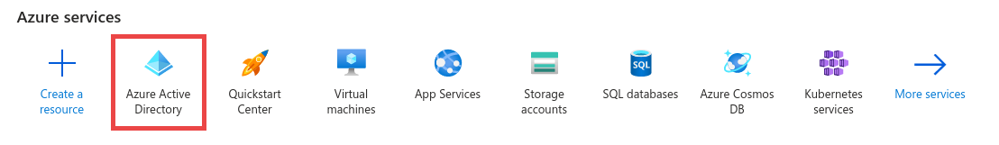
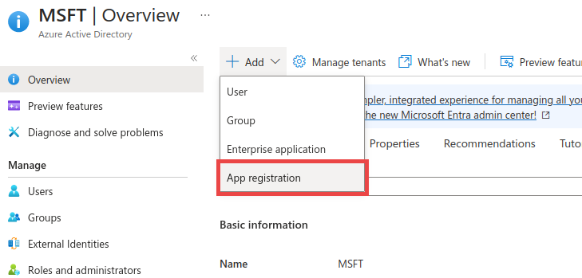
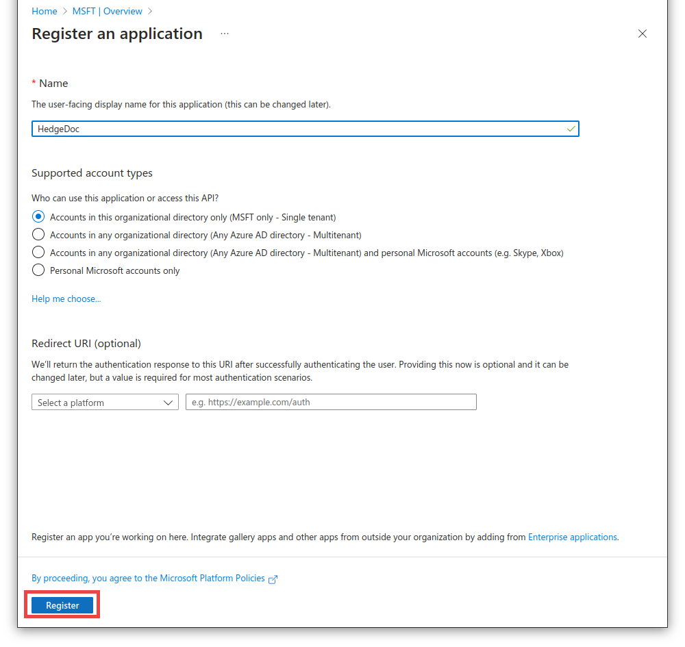
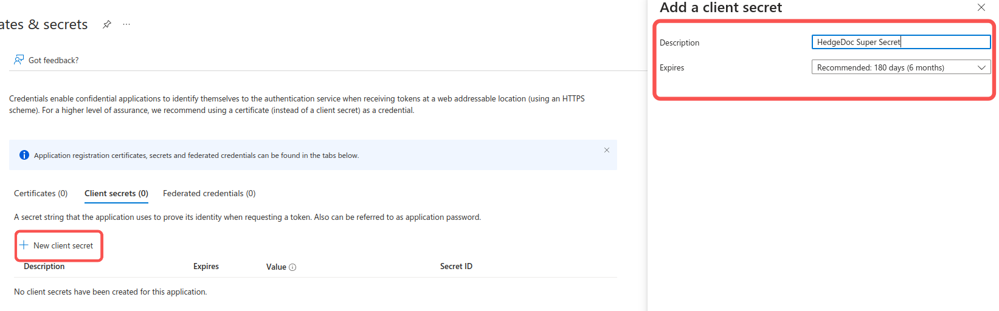
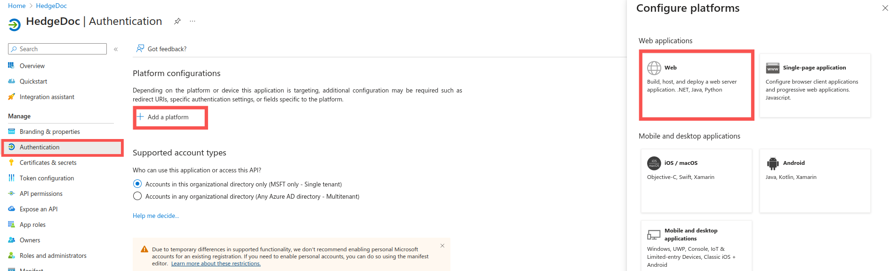
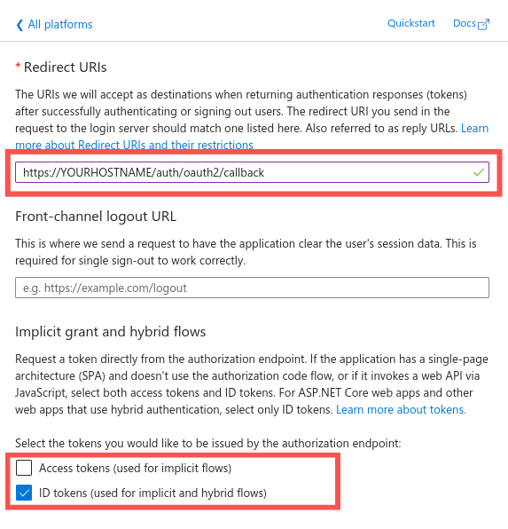
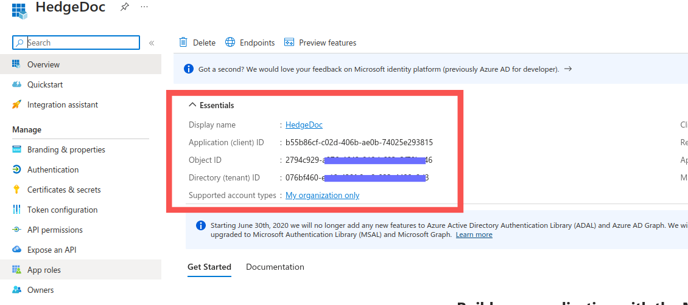

# Authentication Guide: Azure Active Directory

1. Login or Sign-up on portal.azure.com  

2. Navigate to Azure Active Directory from the homepage or the sidebar.  
     

3. Navigate to App Registration  
     

4. Enter Name "HedgeDoc". Then click on Register  
     

5. In the next page, click on `Add a certificate or secret` then navigate to `Client Secrets`.  
   Create a new client secret, add a description of your choice and copy the secret value.  
     

6. Navigate to authentication page, then add a new platform. Select web as the platform.  
     

7. Set the `Redirect URI` to `https://YOURHOSTNAME/auth/oauth2/callback`. Check `ID Tokens` and uncheck `Access Token`.  
     

8. Retrieve the APPLICATION-ID and DIRECTORY-ID from the "Overview" section.  
     

9. Pass in your credentials as environment variables down below.  

```sh
CMD_OAUTH2_USER_PROFILE_URL=graph.microsoft.com/v1.0/me
CMD_OAUTH2_USER_PROFILE_USERNAME_ATTR=userPrincipalName
CMD_OAUTH2_USER_PROFILE_DISPLAY_NAME_ATTR=displayName
CMD_OAUTH2_USER_PROFILE_EMAIL_ATTR=mail
CMD_OAUTH2_USER_PROFILE_ID_ATTR=id
CMD_OAUTH2_TOKEN_URL=https://login.microsoftonline.com/**DIRECTORY-ID**/oauth2/v2.0/token
CMD_OAUTH2_AUTHORIZATION_URL=https://login.microsoftonline.com/**DIRECTORY-ID**/oauth2/v2.0/authorize
CMD_OAUTH2_CLIENT_ID=APPLICATION-ID
CMD_OAUTH2_CLIENT_SECRET=CLIENT-SECRET
CMD_OAUTH2_PROVIDERNAME=AzureAD
CMD_OAUTH2_SCOPE=openid offline_access email profile User.Read
```
