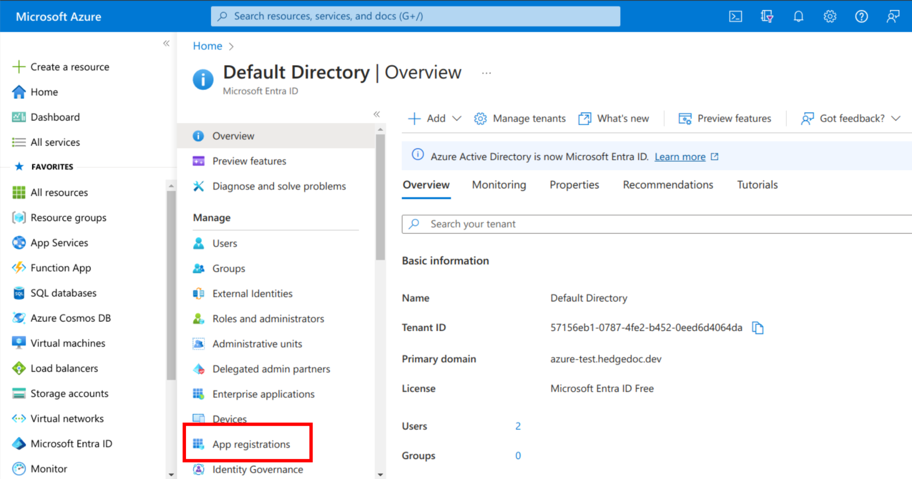
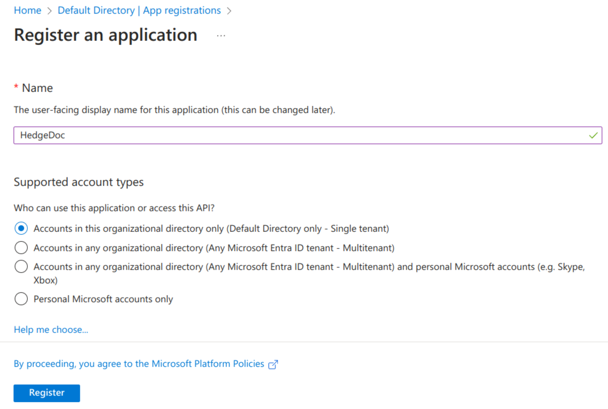
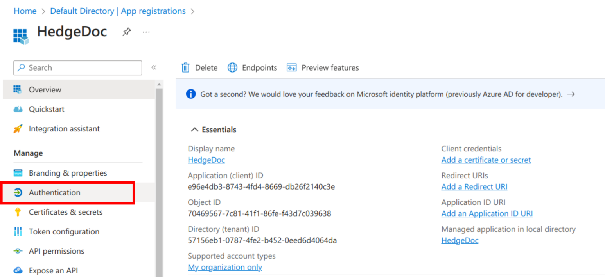
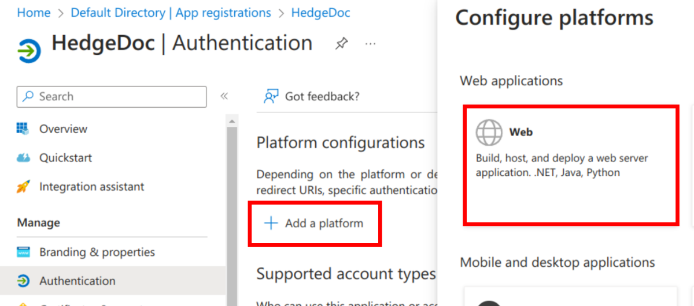
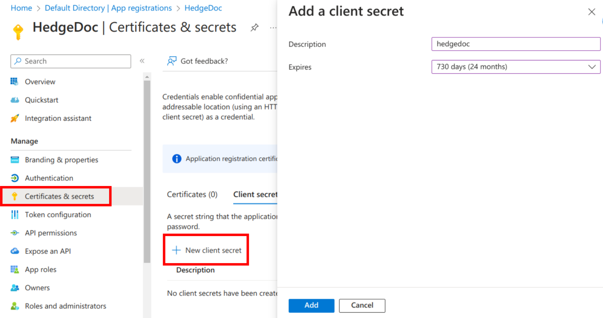
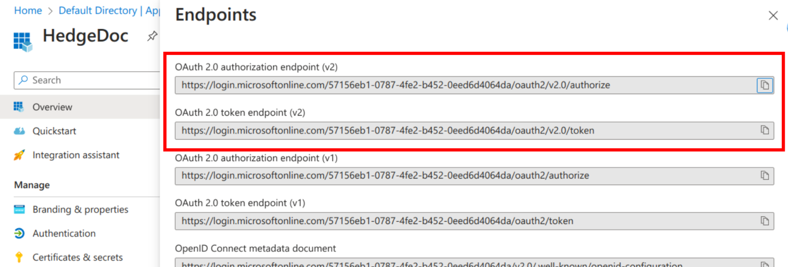
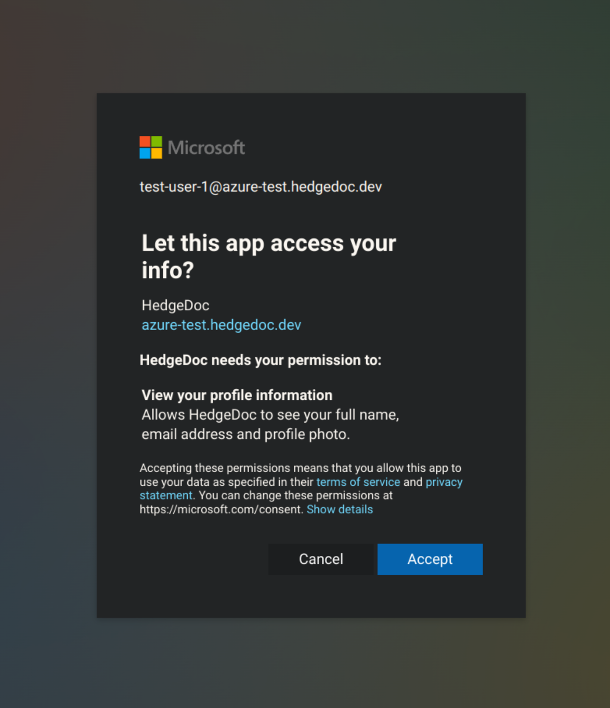

# Authentication Guide: Microsoft Entra ID

!!! info
    Azure Active Directory was renamed to Microsoft Entra ID. Additionally, Microsoft Entra Connect v1 has been
    retired starting October 2023, so you should switch to Microsoft Entra Connect v2.x when using that.

## Pre-requisites

We assume, you've created an account on portal.azure.com and configured a tenant to use with Microsoft Entra ID.
If you haven't done so, please follow the [official guide for that](https://learn.microsoft.com/en-us/entra/fundamentals/create-new-tenant).

Open a text editor alongside to temporarily copy the id, secret and endpoints into it.

## Step-by-step

### Register the HedgeDoc app in Azure

In the Azure Portal navigate to the Microsoft Entra ID service and select "App registrations" in the sidebar.



Select "New registration".


On the registration page enter a name like "HedgeDoc" and select which organizations should have access (the default allows only your tenant).
If you want to allow any Microsoft account to be able to use your HedgeDoc instance, select the 3rd option.
Finally confirm with the "Register" button.



### Creating the OAuth2 bindings in Azure

You will now get to the details screen for your just created application. Copy the "Application (client) ID" into your temporary text editor as we need it later on.
Continue by selecting "Authentication" in the sidebar.



Click the button "Add a platform" and select the "Web" target.



As a next step, navigate to "Certificates & secrets" via the sidebar and click the "New secret" button.
Enter a description as you like and select the expiry time.

!!! warning
    Set yourself a reminder before the secret expires to create a new secret and update the configuration of HedgeDoc.
    Otherwise your users won't be able to sign-in anymore.



Copy the secret value after creation from the page, as you can't access it anytime later again.

Return back to the overview of your HedgeDoc app in Azure and select "Endpoints" from the top bar.
Copy the values of the "OAuth 2.0 authorization endpoint (v2)" and the "OAuth 2.0 token endpoint (v2)".
Ensure, you copied the v2 URLs as the v1 URLs will stop working in the future.



### Configure HedgeDoc

Add the following environment variables to your configuration (for example in the `docker-compose.yml`).
Be sure to replace the values as mentioned in the comments below.

```sh
# Replace these URLs with the ones previously copied.
CMD_OAUTH2_AUTHORIZATION_URL="https://login.microsoftonline.com/123456/oauth2/v2.0/authorize"
CMD_OAUTH2_TOKEN_URL="https://login.microsoftonline.com/123456/oauth2/v2.0/token"

# Replace these values with the previously copied ID and secret.
CMD_OAUTH2_CLIENT_ID="APPLICATION-ID"
CMD_OAUTH2_CLIENT_SECRET="CLIENT-SECRET"

# Change the name if you like it
CMD_OAUTH2_PROVIDERNAME="Microsoft Account"

# Leave these values unchanged
CMD_OAUTH2_USER_PROFILE_URL="https://graph.microsoft.com/oidc/userinfo"
CMD_OAUTH2_USER_PROFILE_USERNAME_ATTR="sub"
CMD_OAUTH2_USER_PROFILE_DISPLAY_NAME_ATTR="name"
CMD_OAUTH2_USER_PROFILE_EMAIL_ATTR="email"
CMD_OAUTH2_USER_PROFILE_ID_ATTR="sub"
CMD_OAUTH2_SCOPE="openid email profile"
```

### Test your login

After configuring, start your HedgeDoc instance. In the login dialog, there should be an orange new button for logging in
via your Microsoft Account. After clicking it, sign-in with your Microsoft Account as usual and confirm the requested permissions.
Now you're logged in.


