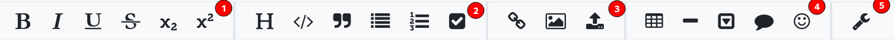
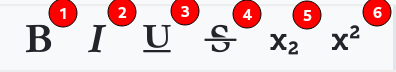
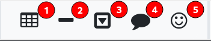
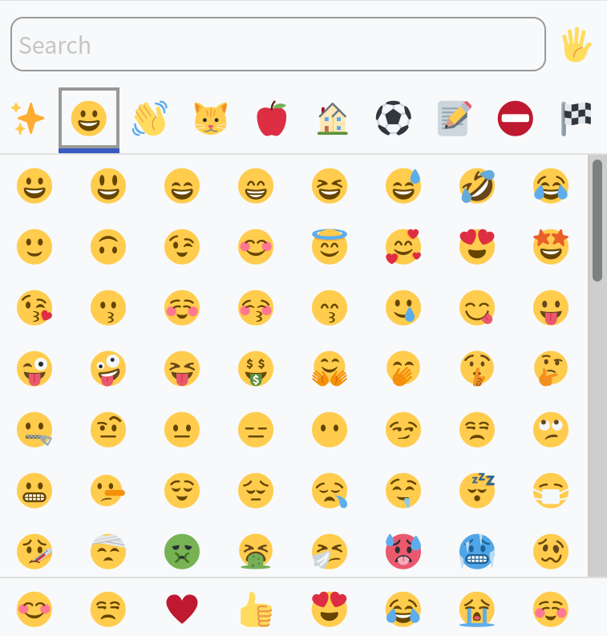

# Toolbar



The Toolbar is found above the editor and is split into five sections:

1. Emphasis
2. Header & Blocks
3. Links & Images
4. Larger Blocks & Emojis
5. Settings

## Emphasis



These buttons are able to either surround selected text with the necessary symbols to emphasize it
or insert the symbols without any content between them to be filled out by you. The icons on
the buttons should be rather easy to identify.
Nonetheless, here is their functionality:

1. bold e.g `**text**`
2. italic e.g `*text*`
3. underscore e.g `_text_`
4. strikethrough e.g `~~text~~`
5. subscript e.g `~text~`
6. superscript e.g `^text^`

## Header & Blocks


These buttons all work a bit different so, we will describe each on separately:

1. **Heading**  
   Adds `#` in front of the line. If the line is already starting with a `#` adds just `#`.
2. **Code Blocks**  
   Adds ` ``` ` around the selected text or if no text is selected just adds two lines with ` ``` `
   and an empty line between them.
3. **Quote**  
   Adds `>` in front of the line.
4. **Unordered List**  
   Ads `-` in front of the line.
5. **Ordered List**  
   Adds `1.` in front of the line.
6. **ToDo List**  
   Adds `- [ ]` in front of the line.

## Links & Images


These buttons add the corresponding syntax at the current cursor position.
If some text is selected it will either put that as the link, if it thinks that the selected text
is a link, or as the alt text.

1. **Link**  
   Adds the link template `[](https://)` (For more information
   see [the markdown link documentation](https://spec.commonmark.org/0.29/#links))
2. **Image**  
   Adds the image placeholder `` (For more information
   see [the markdown image documentation](https://spec.commonmark.org/0.29/#images))
3. **Image Upload**  
   Asks the user to upload an image from their computer and then inserts it in the note.

## Larger Blocks & Emojis



1. **Table**  
   This button opens an overlay, which lets you choose the size of your table up to 10 columns
   and 8 rows. By clicking on any of the squares a table with the corresponding size will be added
   to the note at the position of your cursor.  
     
   A larger table can be created by clicking the 'Custom Size' button.  
     
   In the modal you can specify the exact dimension of your table.
2. **Horizontal Line**  
   This button adds `---` at the current position of your cursor in the note.
3. **Collapsable Block**  
   This button adds a template for a Collapsable Block like this:

   ```markdown
   :::spoiler Toggle label
   Toggled content
   :::
   ```

4. **Comment**  
   This button adds `> []` at the beginning of the line. You can either specify a name
   for your comment by inserting `name=$YourName`, a time by inserting `time=$time`
   or a color by inserting `color=#FFFFFF` in the `[]`.
   Please note that you can only specify one of those per `[]`, but you can use multiple `[]`.
5. **Emoji Picker**  
   This button opens the emoji picker, where you can choose an emoji to insert into your note.  
   

## Settings

ToDo
