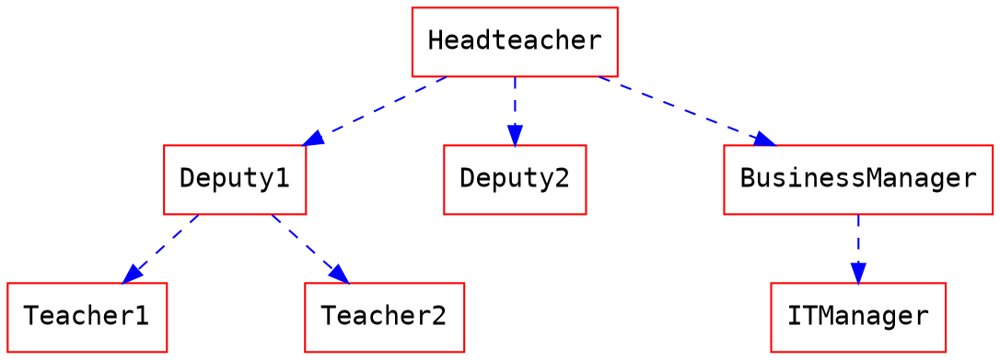
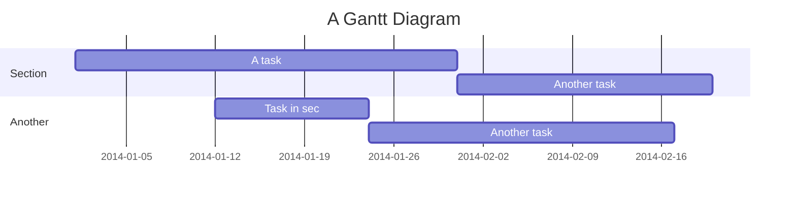

# Markdown Syntax

## Typography

### Headers

``` markdown
# h1 Heading
## h2 Heading
### h3 Heading
#### h4 Heading
##### h5 Heading
###### h6 Heading
```

### Horizontal Rules

___

---

***

### Typographic Replacements

(c) (C) (r) (R) (tm) (TM) (p) (P) +-

test.. test... test.... test..... test?..... test!....

!!!!!! ???? ,,

Remarkable---no, awesome!

During 1980--1988.

"Smartypants, double quotes"

'Smartypants, single quotes'

### Emphasis

**This is bold text**

__This is bold text__

*This is italic text*

_This is italic text_

~~Deleted text~~

lu~lala~

Superscript: 19^th^

Subscript: H~2~O

++Inserted text++

==Marked text==

### Blockquotes

> Blockquotes can also be nested...
>> ...by using additional greater-than signs right next to each other...
> > > ...or with spaces between arrows.

#### Blockquote Tags

> Using the syntax below to specifiy your **name, time and color** to vary the blockquotes.
> [name=ChengHan Wu] [time=Sun, Jun 28, 2015 9:59 PM] [color=#907bf7]
> > Even support nested blockquotes!
> > [name=Max Mustermann] [time=Sun, Jun 28, 2015 9:47 PM] [color=red]

### Lists

#### Unordered

+ Create a list by starting a line with `+`, `-`, or `*`
+ Sub-lists are made by indenting 2 spaces:
  - Marker character change forces new list start:
    * Ac tristique libero volutpat at
    + Facilisis in pretium nisl aliquet
    - Nulla volutpat aliquam velit
+ Very easy!

#### Ordered

1. Lorem ipsum dolor sit amet
2. Consectetur adipiscing elit
3. Aenean commodo ligula eget dolor

1. **You can use sequential numbers...**
1. **...or keep all the numbers as `1.`**
1. Aenean massa
2. Cum sociis natoque penatibus
3. Magnis dis parturient montes
4. Nascetur ridiculus mus
1. Donec quam felis

Start numbering with offset:

57. foo
1. bar

#### Definition Lists

Term 1

:   Definition 1
with lazy continuation.

Term 2 with *inline markup*

:   Definition 2

        { some code, part of Definition 2 }

    Third paragraph of definition 2.

*Compact style:*

Term 1
  ~ Definition 1

Term 2
  ~ Definition 2a
  ~ Definition 2b

#### ToDo List

- [ ] ToDos
  - [x] Buy some salad
  - [ ] Brush teeth
  - [x] Drink some water
  - [ ] **Click my box** and see the source code, if you're allowed to edit!

### Code

Inline `code`

Indented code

    // Some comments
    line 1 of code
    line 2 of code
    line 3 of code

Block code "fences"

```
Sample text here...
```

Syntax highlighting

``` js
var foo = function (bar) {
  return bar++;
};

console.log(foo(5));
```

#### Code Block with Line Numbers

We support many programming languages, use the auto complete function to see the entire list.

```javascript=
var s = "JavaScript syntax highlighting";
alert(s);
function $initHighlight(block, cls) {
  try {
    if (cls.search(/\bno\-highlight\b/) != -1)
      return process(block, true, 0x0F) +
              ' class=""';
  } catch (e) {
    /* handle exception */
  }
  for (var i = 0 / 2; i < classes.length; i++) {
    if (checkCondition(classes[i]) === undefined)
      return /\d+[\s/]/g;
  }
}
```

If you want **line numbers**, type `=` after specifying the code block languagues.
Also, you can specify the start line number.
Like below, the line number starts from 101:

```javascript=101
var s = "JavaScript syntax highlighting";
alert(s);
function $initHighlight(block, cls) {
  try {
    if (cls.search(/\bno\-highlight\b/) != -1)
      return process(block, true, 0x0F) +
              ' class=""';
  } catch (e) {
    /* handle exception */
  }
  for (var i = 0 / 2; i < classes.length; i++) {
    if (checkCondition(classes[i]) === undefined)
      return /\d+[\s/]/g;
  }
}
```

Or you might want to continue the previous code block's line number, use `=+`:

```javascript=+
var s = "JavaScript syntax highlighting";
alert(s);
```

Somtimes you have a super long text without breaks. It's time to use `!` to wrap your code:

```!
When you’re a carpenter making a beautiful chest of drawers, you’re not going to use a piece of plywood on the back.
```

### Tables

| Option | Description                                                               |
| ------ | ------------------------------------------------------------------------- |
| data   | path to data files to supply the data that will be passed into templates. |
| engine | engine to be used for processing templates. Handlebars is the default.    |
| ext    | extension to be used for dest files.                                      |

Right aligned columns

| Option |                                                               Description |
| ------:| -------------------------------------------------------------------------:|
|   data | path to data files to supply the data that will be passed into templates. |
| engine |    engine to be used for processing templates. Handlebars is the default. |
|    ext |                                      extension to be used for dest files. |

Left aligned columns

| Option | Description                                                               |
|:------ |:------------------------------------------------------------------------- |
| data   | path to data files to supply the data that will be passed into templates. |
| engine | engine to be used for processing templates. Handlebars is the default.    |
| ext    | extension to be used for dest files.                                      |

Center aligned columns

| Option |                                Description                                |
|:------:|:-------------------------------------------------------------------------:|
|  data  | path to data files to supply the data that will be passed into templates. |
| engine |  engine to be used for processing templates. Handlebars is the default.   |
|  ext   |                   extension to be used for dest files.                    |

### Links

[link text](https://demo.hedgedoc.org)
[link with title](https://nodeca.github.io/pica/demo/ "title text!")
Autoconverted link <https://github.com/nodeca/pica>

### Images


With a title:


Like links, images also have a footnote style syntax with a reference later in the document defining the URL location:
![Dojocat][dojoref]

[dojoref]: https://octodex.github.com/images/dojocat.jpg  "The Dojocat"

Show the image with given size:


### Footnotes

Footnote 1 link[^first].
Footnote 2 link[^second].
Inline footnote^[Text of inline footnote] definition.
Duplicated footnote reference[^second].

[^first]: Footnote **can have markup**
    and multiple paragraphs.
[^second]: Footnote text.

### Abbreviations

This is an HTML abbreviation example.
It converts "HTML", but keeps intact partial entries like "xxxHTMLyyy" and so on.

*[HTML]: Hyper Text Markup Language

## Extended Syntax

### Table of Contents

Use the syntax `[TOC]` to embed a table of contents into your note.

[TOC]

### Emoji

You can type any emoji like this :smile: :smiley: :cry: :wink:

> See full emoji list [here](https://www.webfx.com/tools/emoji-cheat-sheet/).

### Alert Area

:::success
Yes :tada:
:::

:::info
This is a message :mega:
:::

:::warning
Watch out :zap:
:::

:::danger
Oh No! :fire:
:::

### Externals

#### YouTube



#### Vimeo



#### Gist



#### PDF

**Caution: this might be blocked by your browser if not using an `https` URL.**
Note that not all servers allow embedding their content. See [our FAQ](../faq.md#why-cant-i-embed-some-pdfs) for details.


### MathJax

You can render *LaTeX* mathematical expressions using [**MathJax**](https://www.mathjax.org/),
as on [math.stackexchange.com](https://math.stackexchange.com/). Examples:

* The Euler's identity: $e^{i\pi} + 1 = 0$
* The solution of $f(x)=ax^2+bx+c$ where $a \neq 0$ and $a, b, c \in R$ is
$$
x = {-b \pm \sqrt{b^2-4ac} \over 2a}
$$
* The *Gamma function*: $\Gamma(n) = \begin{cases}
  \displaystyle (n-1)!\quad\forall n\in\mathbb N\\
  \displaystyle \int_0^\infty t^{n-1}e^{-t}dt\quad\forall n\in\mathbb R^*_+
  \end{cases}$

> More information about **LaTeX** mathematical expressions [here](https://meta.math.stackexchange.com/questions/5020/mathjax-basic-tutorial-and-quick-reference).

### Diagrams

#### UML Sequence Diagrams

You can render sequence diagrams like this:

```sequence
Alice->Bob: Hello Bob, how are you?
Note right of Bob: Bob thinks
Bob-->Alice: I am good thanks!
Note left of Alice: Alice responds
Alice->Bob: Where have you been?
```

More information about **sequence diagrams** syntax [here](https://bramp.github.io/js-sequence-diagrams/).

#### Flow Charts

Flow charts can be specified like this:

```flow
st=>start: Start
e=>end: End
op=>operation: My Operation
op2=>operation: lalala
cond=>condition: Yes or No?

st->op->op2->cond
cond(yes)->e
cond(no)->op2
```

More information about **flow charts** syntax [here](https://flowchart.js.org/).

#### Graphviz



More information about **graphviz** syntax [here](https://www.tonyballantyne.com/graphs.html)

#### Mermaid



More information about **mermaid** syntax [here](https://mermaid-js.github.io/mermaid/)

This version of HedgeDoc bundles Mermaid 9.1.7. The documentation for this version can
be found [here](https://github.com/mermaid-js/mermaid/blob/v9.1.7/docs/n00b-gettingStarted.md).

#### Abc Music Notation

```abc
X:1
T:Speed the Plough
M:4/4
C:Trad.
K:G
|:GABc dedB|dedB dedB|c2ec B2dB|c2A2 A2BA|
GABc dedB|dedB dedB|c2ec B2dB|A2F2 G4:|
|:g2gf gdBd|g2f2 e2d2|c2ec B2dB|c2A2 A2df|
g2gf g2Bd|g2f2 e2d2|c2ec B2dB|A2F2 G4:|
```

More information about **abc** syntax [here](https://abcnotation.com/learn)
